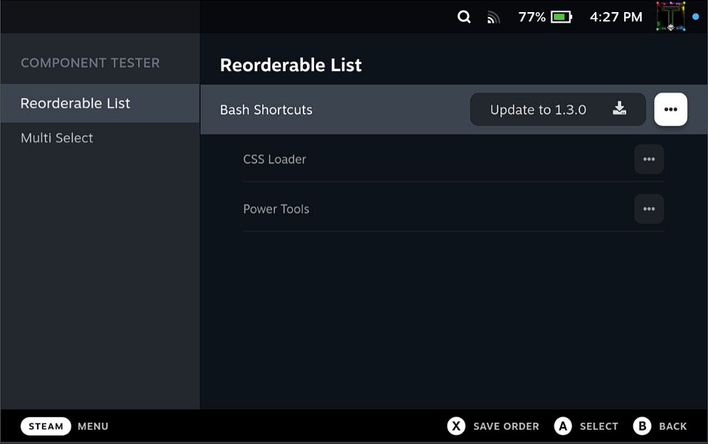
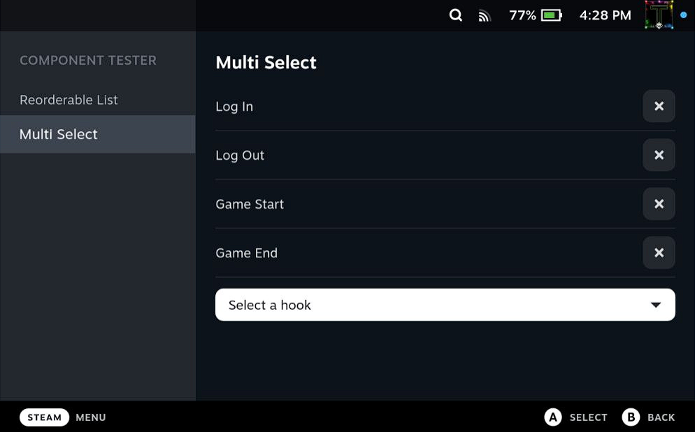

# Component-Testing-Plugin 

Plugin for rapid UI component itteration and testing.

## Developers

### Setup

Install pnpm:
```bash
npm i -g pnpm
```

Building for deployment:
```bash
pnpm i
```
then:
```bash
pnpm run build
```

#### Other important information

Everytime you change the frontend code (`index.tsx` etc) you will need to rebuild using the commands from step 2 above or the build task if you're using vscode or a derivative.

Note: If you are receiving build errors due to an out of date library, you should run this command inside of your repository:

```bash
pnpm update decky-frontend-lib --latest
```

## Contents

### Reorderable List

<br/>
A customizeable list component that supports reordering its entries.
<br/>

### Multi Select

<br/>
A customizeable dropdown that supports selecting multiple options.
<br/>
<br/>